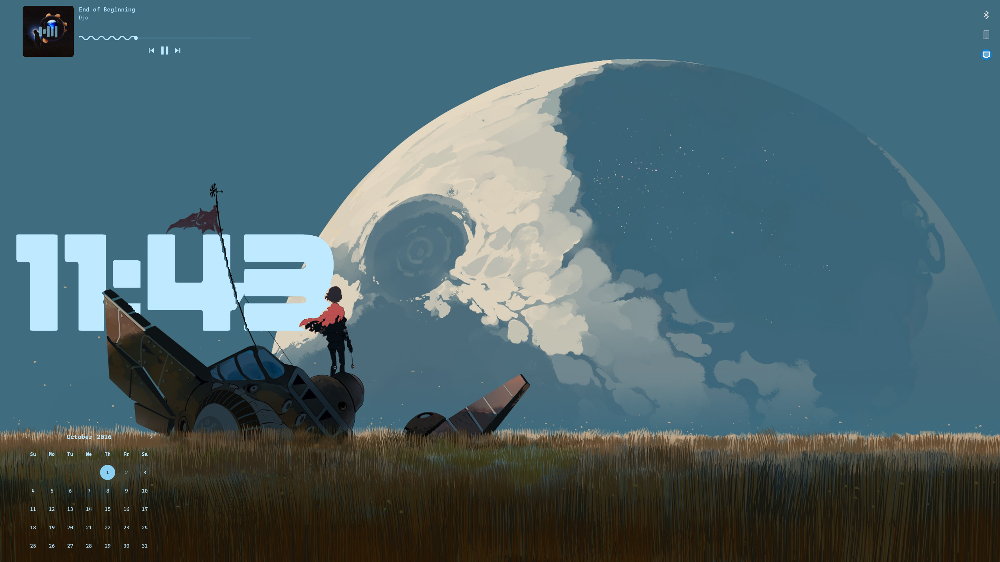
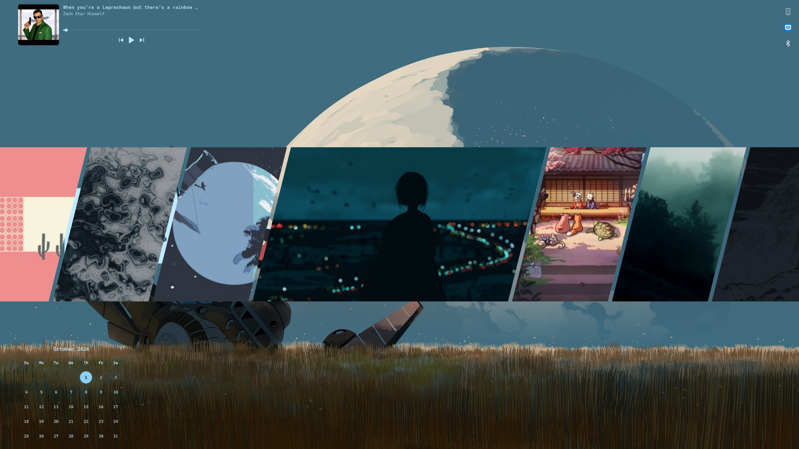
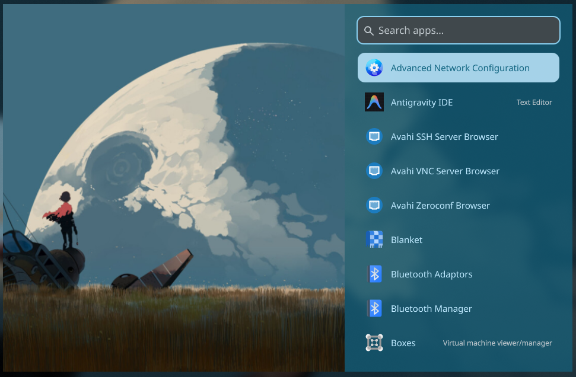
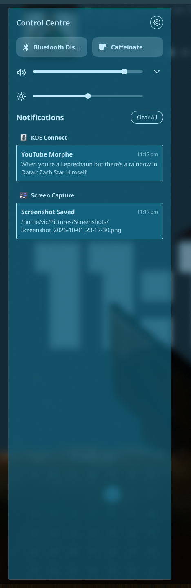
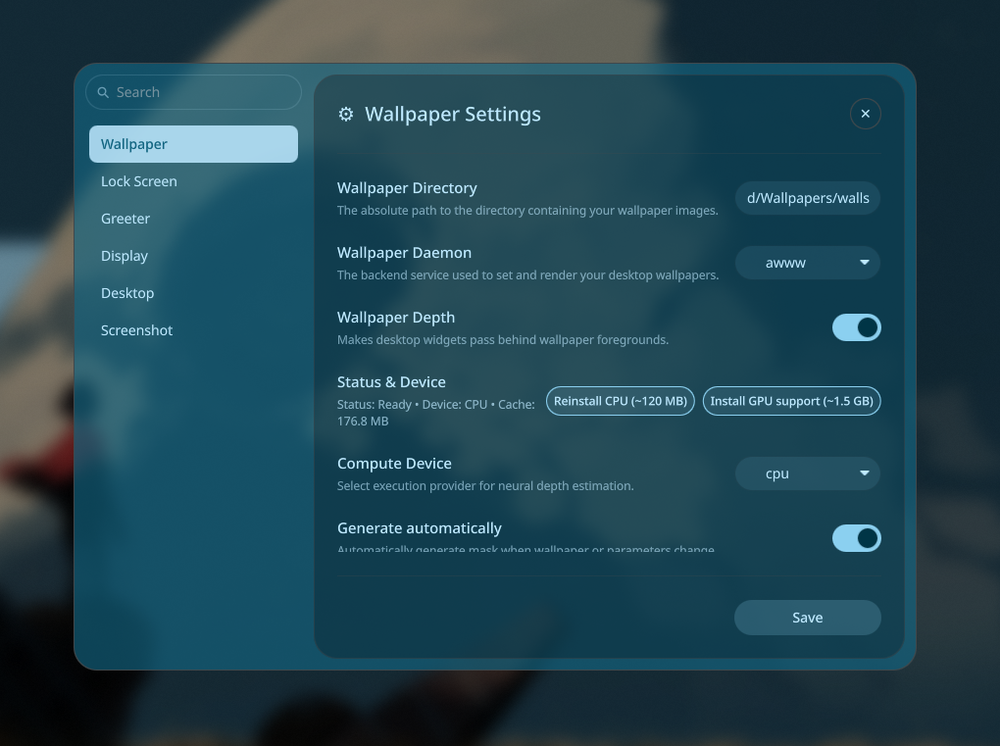
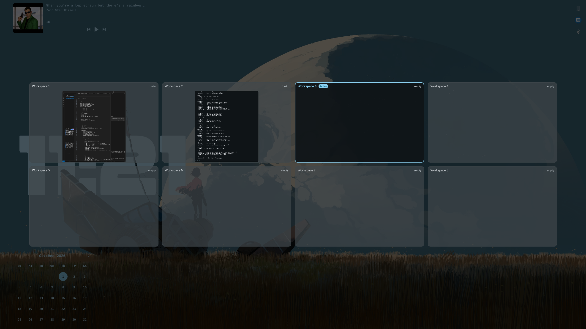
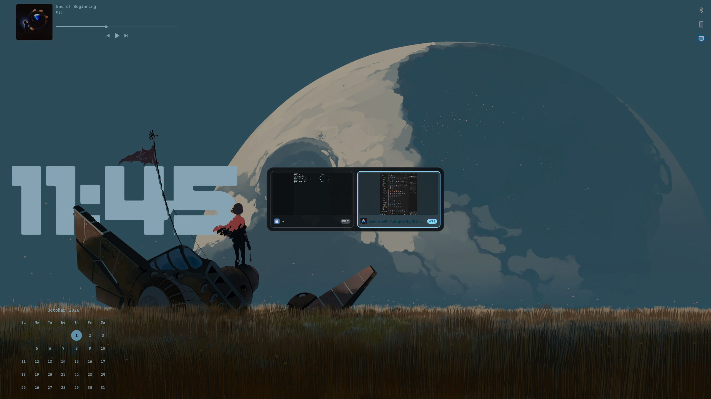
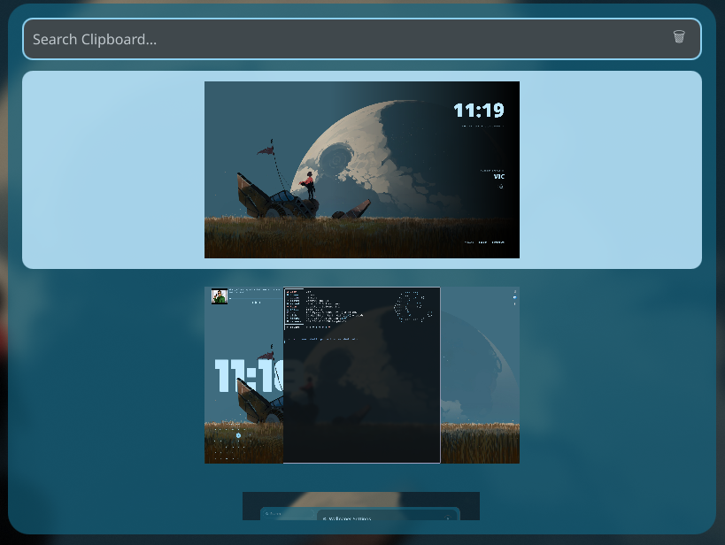
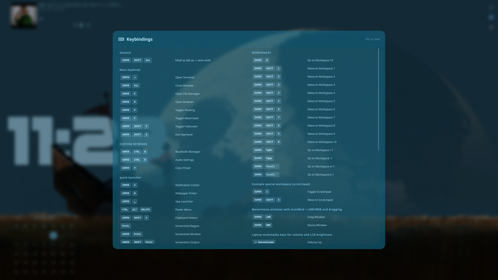

# Xeon Shell 🚀

A minimal, feature-rich shell environment built with [Quickshell](https://quickshell.outfoxxed.me/) for Hyprland.

> [!WARNING]
> **Vibe Coded Project:** This is a fully vibe-coded project. If you are uncomfortable with this, please ignore this repository.

## ✨ Features

Xeon Shell provides a comprehensive set of built-in tools and menus to keep your desktop lightweight and functional:

- **Desktop Widgets & Wallpaper Depth**: Clock, calendar, and media controls featuring neural depth masking that seamlessly places widgets behind wallpaper elements.
- **App Launcher**: Quickly find and launch your applications.
- **Control Center & Notifications**: Manage system notifications, volume/brightness sliders, and quick toggles.
- **Workspace Overview**: Interactive visual workspace overview displaying active windows across all Hyprland workspaces. Drag open apps between workspaces directly from the overview.
- **Window Switcher (Alt-Tab)**: Fast keyboard-driven application switcher with live window previews.
- **Settings GUI**: Centralized preferences for wallpaper selection, neural depth estimation (CPU/GPU), lock screen, greeter, and widgets.
- **Keybindings Cheatsheet**: Quick visual reference overlay for Hyprland and shell shortcuts.
- **Wallpaper Selector**: Easily switch between your favorite backgrounds.
- **Blue Light Filter**: Night light with auto sunrise/sunset geolocation calculation, custom scheduling, and smooth gamma transitions via Wayland protocol.
- **Idle Dimming**: Intelligent pre-lock dimming for laptop panels and external monitors (DDC/CI).
- **Desktop MPRIS & Audio**: Media controls, album artwork, track seekbar, and audio sink switcher.
- **Power Menu**: Sleek system controls (shutdown, reboot, suspend, etc.).
- **Clipboard Manager**: A full, lightweight clipboard manager written entirely in QML (no reliance on `cliphist`).
- **Screenshot & Screen Record Utility**: Capture and record your screen effortlessly.
- **Lockscreen & Greeter**: Custom lockscreen and `greetd` login greeter interface featuring PAM authentication.
- **OSD**: A simple OSD for brightness or volume changes.

## 📸 Screenshots

### Desktop with Widgets & Wallpaper Depth


### Wallpaper Selector


### App Launcher


### Control Center & Notifications


### Settings Window


### Workspace Overview


### Window Switcher (Alt-Tab)


### Clipboard Manager


### Keybindings Cheatsheet


### Lock Screen & Greeter


## 📦 Dependencies

Ensure you have the following installed on your system before proceeding:

### Core Requirements
- **[Quickshell](https://quickshell.outfoxxed.me/)**: The core QML shell environment (`qs`).
- **[Hyprland](https://hyprland.org/)**: The Wayland compositor (heavily relies on `hyprctl`).
- **greetd**: Display manager daemon (required for the built-in Quickshell login greeter).
- **qt6-5compat**: Qt6 compatibility module for QML effects and legacy transitions.
- **jq**: JSON parsing in scripts.
- **python3**: Required for geolocation and greeter helper bridge.
- **wl-clipboard**: Required for the QML clipboard manager (`wl-paste`).

### Theming & Multimedia
- **awww** / **swww**: Wallpaper daemon (supports `hyprpaper` as well).
- **matugen**: Used for Material You dynamic theme generation based on your wallpaper.
- **magick (ImageMagick)**: Required for generating wallpapers, thumbnails, and preview images.
- **playerctl**: Controls MPRIS media players and streams track metadata.
- **pipewire-pulse** / **pulseaudio-utils**: Provides `pactl` for audio sink and volume control.
- **ffmpeg**: Used for video thumbnail generation and screen recording encoding.

### Hardware & Power
- **brightnessctl**: Laptop screen brightness adjustments and idle dimming.
- **ddcutil**: External monitor brightness control and idle dimming via DDC/CI.
- **bluez-utils**: Provides `bluetoothctl` for Bluetooth status and battery reporting.
- **systemd / logind**: Required for power menu actions via `loginctl` and `systemctl`.

## 🛠️ Installation

1. **Install Quickshell**: Follow the instructions on the [Quickshell website](https://quickshell.outfoxxed.me/) to install it for your distribution.
2. **Clone the repository**: Download this configuration to your Quickshell config directory.
   ```sh
   git clone <repository_url> ~/.config/quickshell/xeon-shell
   ```
   *(If you've already cloned it, simply move the `xeon-shell` folder to `~/.config/quickshell/`)*
3. **Run the install script**:
   ```sh
   cd ~/.config/quickshell/xeon-shell
   ./deploy-install/install.sh
   ```
   *(Note: Settings migration only happens via this install script. If you pull updates without running install.sh, old settings won't migrate.)*
4. **Run the shell**:
   ```sh
   qs -c xeon-shell
   ```

## 🎮 Usage & IPC Calls

Xeon Shell is controlled via Quickshell's Inter-Process Communication (IPC). You can bind the following commands in your Hyprland configuration (`hyprland.conf`) to toggle various menus.

### Available Commands:

- **App Launcher**: `qs -c xeon-shell ipc call launcher toggle`
- **Wallpaper Selector**: `qs -c xeon-shell ipc call wallpaper toggle`
- **Clipboard Manager**: `qs -c xeon-shell ipc call clipboard toggle`
- **Power Menu**: `qs -c xeon-shell ipc call power toggle`
- **Notification Center**: `qs -c xeon-shell ipc call notif toggle`
- **Screenshot Utility**: `qs -c xeon-shell ipc call screenshot toggle`
- **Lock Screen**: `qs -c xeon-shell ipc call lock lock`

### Help

For more information about available IPC calls and extended options, run:

```sh
qs -c xeon-shell ipc call help display
```
